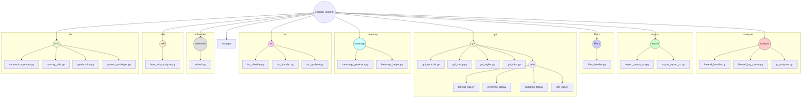

```mermaid
%%{ init: {'flowchart': {
    'rankDir': 'TB',
    'nodeSpacing': 20,
    'rankSpacing': 60,
    'ranker': 'tight-tree'
} } }%%
flowchart TB
    node1((Security Scanner))
    node1 --> node2((analyzer))
    subgraph analyzer
    node2 --> node3[firewall_handler.py]
    node2 --> node4[firewall_log_parser.py]
    node2 --> node5[ip_analyzer.py]
    end
    style node2 fill:#ffcccc,stroke:#333,stroke-width:1px
    node1 --> node6((export))
    subgraph export
    node6 --> node7[export_report_csv.py]
    node6 --> node8[export_report_txt.py]
    end
    style node6 fill:#ccffcc,stroke:#333,stroke-width:1px
    node1 --> node9((filters))
    subgraph filters
    node9 --> node10[filter_handler.py]
    end
    style node9 fill:#ccccff,stroke:#333,stroke-width:1px
    node1 --> node11((gui))
    subgraph gui
    node11 --> node12[gui_controls.py]
    node11 --> node13[gui_setup.py]
    node11 --> node14[gui_styles.py]
    node11 --> node15[gui_tabs.py]
    node11 --> node16((tabs))
    node16 --> node17[firewall_tab.py]
    node16 --> node18[incoming_tab.py]
    node16 --> node19[outgoing_tab.py]
    node16 --> node20[ssh_tab.py]
    end
    style node11 fill:#ffffcc,stroke:#333,stroke-width:1px
    node1 --> node21((heatmap))
    subgraph heatmap
    node21 --> node22[heatmap_generator.py]
    node21 --> node23[heatmap_helper.py]
    end
    style node21 fill:#ccffff,stroke:#333,stroke-width:1px
    node1 --> node24((ioc))
    subgraph ioc
    node24 --> node25[ioc_checker.py]
    node24 --> node26[ioc_handler.py]
    node24 --> node27[ioc_updater.py]
    end
    style node24 fill:#ffccff,stroke:#333,stroke-width:1px
    node1 --> node28[main.py]
    node1 --> node29((scheduler))
    subgraph scheduler
    node29 --> node30[refresh.py]
    end
    style node29 fill:#e0e0e0,stroke:#333,stroke-width:1px
    node1 --> node31((ssh))
    subgraph ssh
    node31 --> node32[linux_ssh_analyzer.py]
    end
    style node31 fill:#ffedcc,stroke:#333,stroke-width:1px
    node1 --> node33((utils))
    subgraph utils
    node33 --> node34[connection_reader.py]
    node33 --> node35[country_utils.py]
    node33 --> node36[geolocation.py]
    node33 --> node37[system_privileges.py]
    end
    style node33 fill:#edffcc,stroke:#333,stroke-width:1px
```